# 01 調査結果（実プレイと宣伝資料の対比）

実際に遊んで撮ったキャプチャと、宣伝資料の主張を並べます。
**「宣伝に載っていて実装に無い／しょぼい」もの**だけを挙げます（載っていない追加機能は問題なしなので割愛）。

## 調査の条件

| 項目 | 値 |
|---|---|
| サーバ | `npm run dev:server`（LLM=real / `gpt-5.6-luna`） |
| 島 | seed `pokomofu-2` / islandId `main`（既存DBを引き継ぎ、他プレイヤーのペット6匹が在島） |
| クライアント | `http://localhost:5176/?debug=1` |
| 画面 | PC 1280×720 / スマホ 390×844 |
| 見た時間帯・天気 | 昼・くもり / 夕 / 夜 / 昼・あめ（夜と雨はDBの`tick`と`weather`を書き換えて再起動して再現） |
| 実測 | fps 120、RTT 1ms、tick p95 0.87ms、動物79〜86体、夜間睡眠率 0.97 |

**性能・機能は問題なし。** `GET /metrics` を見る限り、住民のAI・関係（友達51組・出産3件）・
ペットの意思決定（`talk_to`/`gather`/`visit_friend`が理由つきで出る）・ペット間会話と噂・
オフライン早送りは、すべて宣伝資料どおりに動いていました。

---

## 1. 機能面 — 宣伝にあって実装に無いもの

| 宣伝資料の記述 | 実装 | 判定 |
|---|---|---|
| 「5種のタマゴから1匹を連れて行けます」 | タマゴの絵が無く、ペットの顔アイコンを選ぶ画面 | ⚠️ 表現の欠落（→ E-4） |
| 「共同作業：橋づくりなど、みんなで少しずつ進める建設」 | サーバ側は完全に動く。**しかし予定地に何の絵も出ない**ので、島を歩いても建設できることに気づけない | ⚠️ 見た目が無い（→ G-1） |
| 「おでかけ：友だちの区画へ遊びに行き、記念撮影」 | **区画の概念も撮影機能も無い**（grep でヒット0） | ❌ 未実装（→ G-3） |
| 「環境の記憶：荒らした畑は戻るのに時間がかかる」 | サーバは荒廃度を持っているが、**描画は `tilemap.ts:125` に TODO のまま**。荒れタイル率も最大0.7%で目に見えない | ❌ 未実装（→ G-4） |
| 「川むこうの木の実」「川辺で自然に出会う」 | 島にあるのは**海だけ**。川は生成されない | ⚠️ 資料の記述を直すか川を作る（→ H-3 / C-1） |

これ以外の機能（自律行動・LLM会話・長期記憶・日記・留守中サマリ・噂の報告・懐き度・
同時接続・オフライン進行・収穫・水やり・設置）は**すべて実機で確認できました**。

---

## 2. 絵の乖離 — ここが本題

### 2-1. 地面が単色のベタ塗りで、画面の大半が「無地の緑」

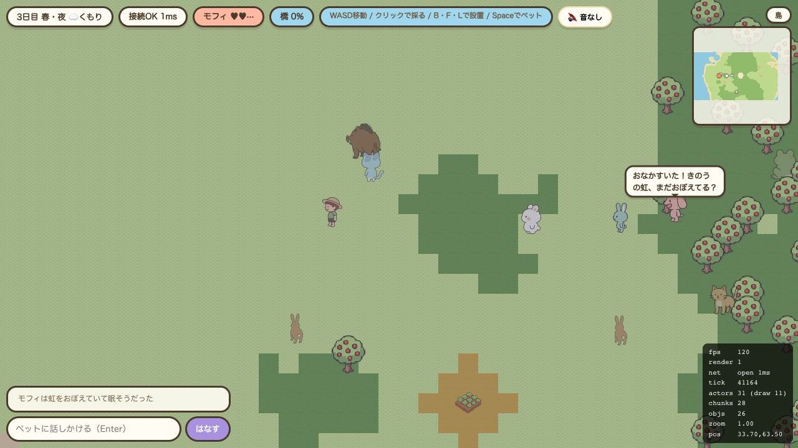

島の西側。**草地タイルが一様なドット模様1枚のみ**で、草の房・小花・小石・落ち葉といった
装飾が一切ありません。森タイル（濃い緑）も四角い階段状に切り替わるだけで「森」に見えず、
畑が十字型に浮いています。宣伝資料のヒーロー画像は、同じ面積に木・茂み・花・道・柵・家が
詰まっています。

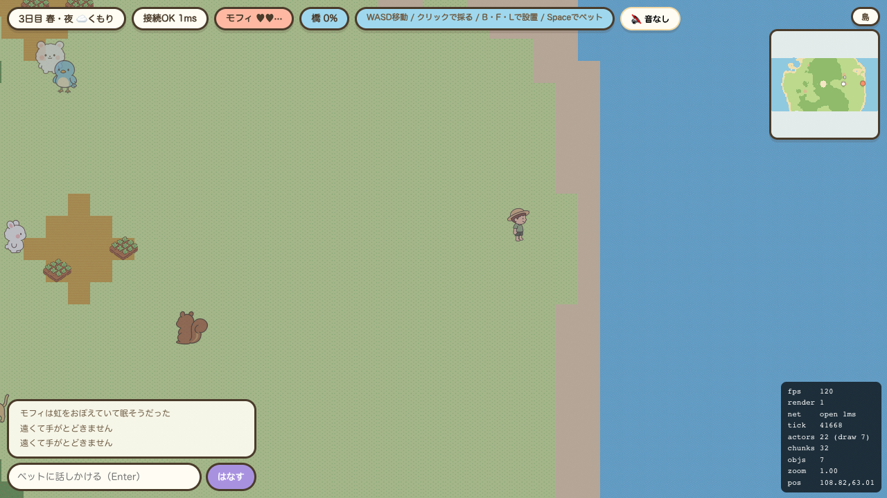

島の東側。**画面の9割が無地**。畑1つと作物2個以外に何もありません。

### 2-2. タイルの遷移（autotile）が無く、境界が完全なピクセル階段

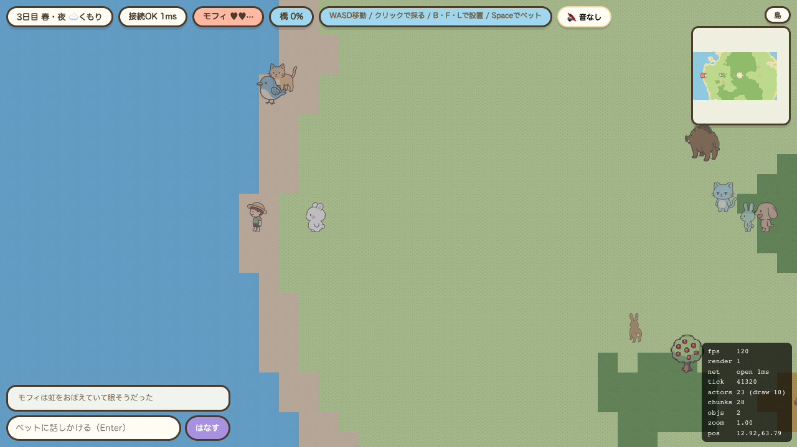

海岸。**海が完全な1色のフラットな青**で、波・白波・浅瀬のグラデーション・きらめきがありません。
砂浜は1タイル幅で、陸と海の境界が45度の階段になっています。
広場（クリーム色）の縁も同じで、宣伝資料の「円形の石畳」とは別物です。

### 2-3. 島に建物が1軒も無い

宣伝ヒーロー画像には**家3軒・風車・柵・小道・橋**があります。
実装の島にあるのは「木の実の木・畑・水場・釣り場」だけで、
プレイヤーが `B`/`F`/`L` でベンチ・花壇・ランタンを置くまで、人工物はゼロです。

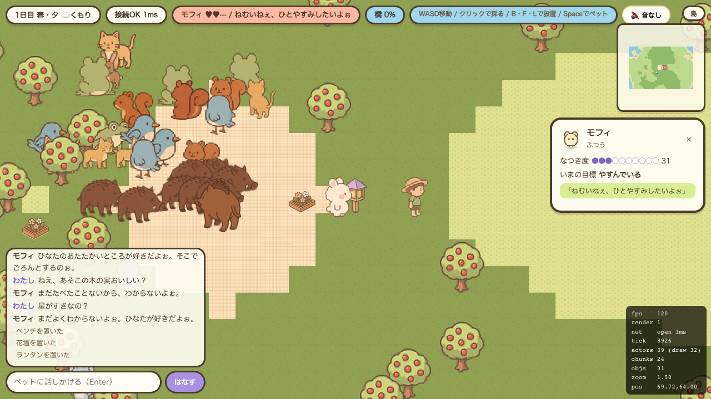

置いてもこの大きさ（32px相当）で、島の景観にはほとんど影響しません。

### 2-4. 接地影が無く、キャラが地面から浮いて見える

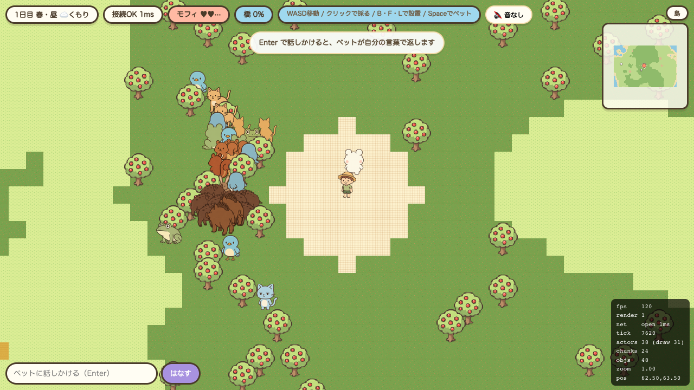

プレイヤー・ペット・動物・オブジェクトのすべてに影がありません。
宣伝資料のキャラは全員、足元に楕円の影があります。

### 2-5. ペットの識別パーツが落ちている

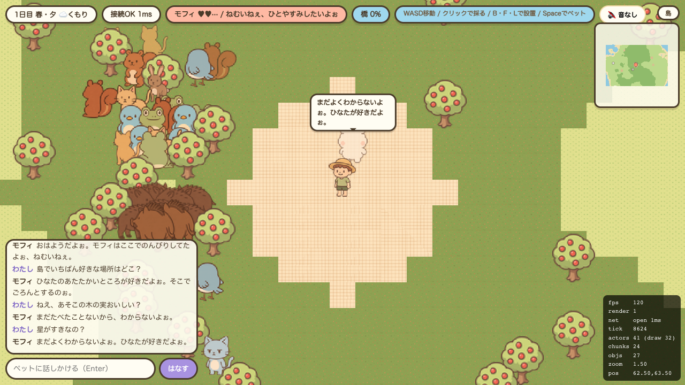

モフィ（雲のこ）の**頭上の水色の光輪（halo）がスプライトに描かれていません**。
宣伝資料 `images/pets.png` では、halo がモフィの最大の特徴です。
同様に、ミズネの額の水滴・ハッカの葉・ホシラの星も要確認です。

宣伝ヒーロー画像・会話画像でも halo は必ず描かれているので、
**同じキャラだと認識できないレベルの差**になっています。

### 2-6. 動物が団子状に密集して破綻する

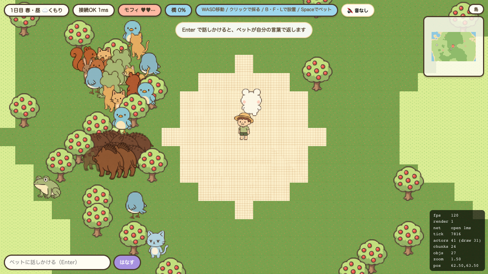

広場の北西に**10体以上が重なって**います。いのししが4体重なると、
茶色い塊になって何なのか分かりません（いのししは絵が横長なので描画側で1.3倍している）。
宣伝資料は「それぞれが自分の都合で動く住民」に見えるように散らばっています。

### 2-7. プレイヤーが全員まったく同じ見た目

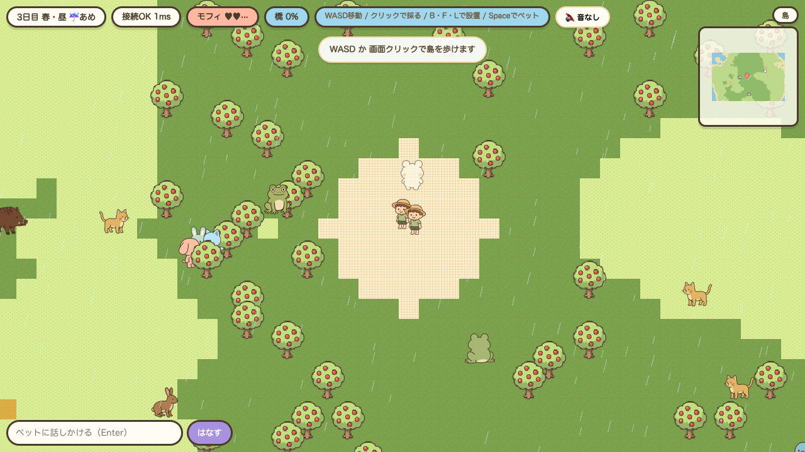

アセットは `player_a_{n,s,e,w}.png` の4枚だけ。
宣伝のマルチプレイ画像は**紫・緑・桃・黄のフード服4人**で、
「同じ島に他のプレイヤーがいる」楽しさの多くをこの色分けが担っています。

---

## 3. 演出の乖離

### 3-1. 夜になっても暗くならない

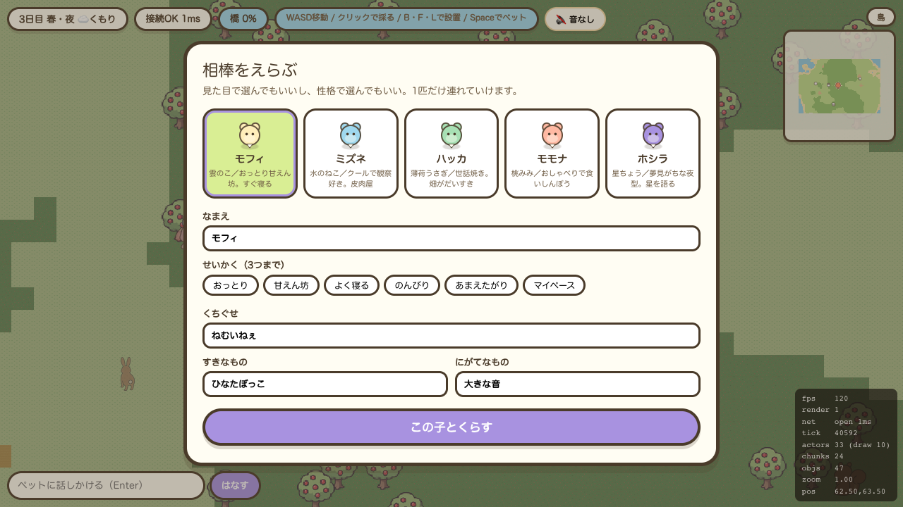

HUDは「3日目 春・夜」と出ていますが、**画面はほぼ昼と同じ明るさ**です。
同じ座標の草地のRGBを比べると `(168,175,111)` → `(133,139,104)`。
`effects.ts` の `night: { color: 0x24356e, alpha: 0.3 }` が効いてはいますが、
20%暗くなるだけで「夜」として読めません。

宣伝資料 `images/screen-ecosystem.png` の夜は**濃紺・月・星・焚き火・ランタンの光**です。
実装には星・月・光源が1つもありません。

### 3-2. 「灯り」が光らない

`L` で置いたランタン（`obj_lantern`）は、夜でも**ただの絵**です。
加算光の描画が無いため、宣伝資料の焚き火・ランタンのような光の玉になりません。

### 3-3. 眠っている動物が立ったまま

夜間睡眠率は0.97（`/metrics`）で、**シミュレーションは正しく眠っています**。
しかし描画は `sprites.ts:172` の `alpha = 0.75` だけ。
宣伝資料は**巣で丸まって眠る**姿で、そこが「夜はちゃんと寝る」の証拠になっています。
巣（nest）そのものも描かれていません（しかも WeakMap 保持で再起動すると忘れる、M3申し送り4）。

### 3-4. 雨が弱い

白い斜線がうっすら降るだけで、地面が濡れる・水たまり・波紋・雨音がありません。
「雨の日は木の下に集まり」という情感が画面に出ていません。

### 3-5. 季節の色が変わらない

春・夏・秋・冬でタイルの色も木の絵も変わりません。
宣伝資料は「実りの季節には食べものが増え、冬には巣にこもる」と謳っています。

---

## 4. UI の乖離

宣伝資料 `images/screen-talk.png` の画面イメージと実装の対応：

| 宣伝資料の画面 | 実装 |
|---|---|
| 左上に**ハート（懐き度）と水滴（おなか）の2本ゲージパネル** | HUDの横長ピルに「モフィ ♥♥…」とセリフを並べただけ |
| ペットの頭上に**大きな丸い吹き出し** | 吹き出しはあるが小さく、**3.2秒で消える**ので気づきにくい。撮影のためにDOMを監視しないと捕まらなかった |
| 右下に**丸いアクションボタン3つ**（足あと・水やり・収穫） | ボタンが無い。操作は `B`/`F`/`L` キーとクリック（HUDに文字で案内） |

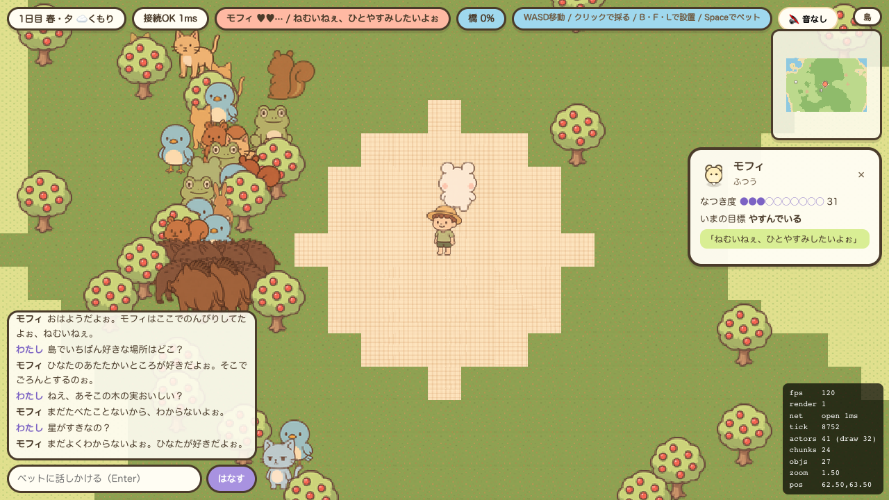

`Space` のペット情報パネルは「なつき度メーター・いまの目標・セリフ」で、内容は良いのですが
宣伝資料の常時表示ゲージとは別物です。

### スマホ（390×844）

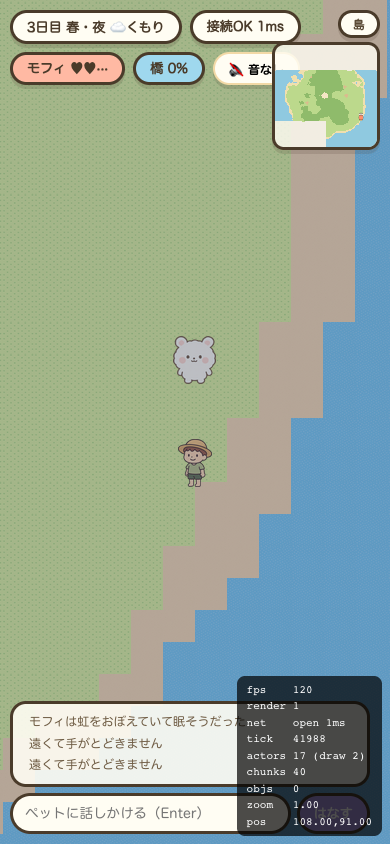

**ミニマップが「音なし」チップに重なっています**（`layout.mobile.e2e.ts` は
チャット欄と案内バナーの重なりは見ているが、ミニマップとHUDチップの重なりは見ていない）。

---

## 5. 視点そのものの乖離（要判断）

宣伝資料の技術欄に **`GRAPHICS: 2D クォータービューの手描き風タイル`** と書いてあります。
実装は**完全な真上からのトップダウン**（32pxの正方タイルを格子に並べる）です。

クォータービュー化には、タイルマップ・カメラ・座標変換・深度ソート・当たり判定・
ミニマップ・全アセット（62枚）の作り直しが必要で、**実質フルリメイク**になります。

→ `02_是正プラン.md` の **A-1** で「トップダウンを維持し、絵柄で"見下ろし斜め"の印象を作る＋
宣伝資料の表記を直す」方針を推奨しています。
