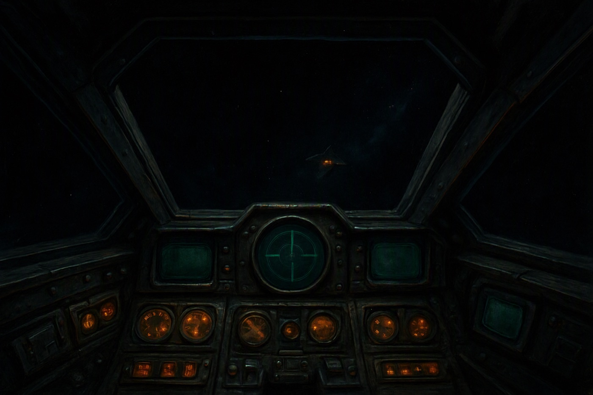
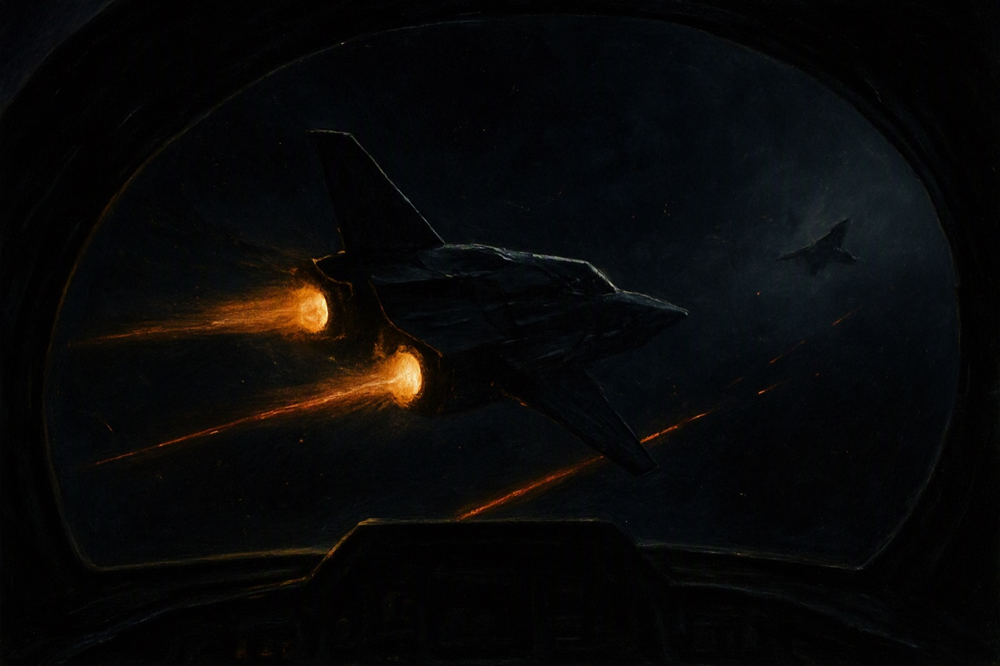

# MULTI-COMMANDER 更なる改善案 — サマリ

検証日: 2026-08-09 / 2026-08-10
検証方法: `npm run dev` を 1280×720 の Chrome で実機プレイ（THE VEIL FRONT を新規開始、難易度「やさしい」、第1章と第2章を通しでプレイ）
関連資料: [01_プレイ記録と所見.md](01_プレイ記録と所見.md) / [02_改善案の詳細.md](02_改善案の詳細.md) / [03_進め方とロードマップ.md](03_進め方とロードマップ.md)

---

## いちばん大きな結論

**「作り込みが足りない」のではなく、「作り込んだものがプレイヤーに届いていない」状態です。**

このゲームには既に、五勢力の設定、76名の人物名簿、十章のシナリオ、章末の選択、部位破壊、
合成BGM、生成された顔画像 —— ウィングコマンダーに匹敵する量の中身があります。
文章の質は本家より上と言っていい水準です。

しかし実際に2章プレイした結果は、こうでした。

| 起きたこと | プレイヤーから見た意味 |
|---|---|
| 第1章は `A` キーを2回押しただけで「**任務達成**」。目標は全部「未達」と表示された | 何をしても勝つので、うまくやる理由がない |
| 「帰還者」の値が 0 → 80 に上がった。救助した人数は **0名** | 数字が自分の行動と関係なく動く |
| 第2章で撃墜された。至近距離（239m）でも**敵機は画面に映らなかった** | 何に負けたか分からない |
| 僚機 Sable が戦死。画面隅に「Sable 破壊」と薄く出ただけ | 直後の「追悼」画面が響かない |
| 自機撃墜の瞬間、演出なしで暗転して選択画面へ | 死んだ実感がない |
| 死んでも戦役は続き、次の章へ進んだ | 死が怖くない |

つまり **一回の出撃に賭けているものが何もない**。
ウィングコマンダーとの差は、機能の数ではなく、ここ一点に集約されます。

---

## 改善の三本柱

### 柱1 — 一回の出撃に「賭け金」を作る（最優先）

勝敗・生死・仲間の生存が、プレイヤーの操作の結果として決まるようにする。

- 「守る」「時間内に」といった条件を、**達成すべき目標として勝敗に数える**
- 撃墜されたら、その章は失敗として扱う（やり直せる／脱出できる出口は用意する）
- 章末の選択は、**その出撃で実際にやったことから提示される**ようにする
- 「帰還者」などの数値は、**自分が救った／落とされた人数**で動かす

### 柱2 — 見える戦闘にする

いま戦っている相手が画面の中にいることを、目で分かるようにする。

- 敵機が近づいたら**大きく、明るく、輪郭で**見えるようにする
- コクピットの枠（風防・柱・計器盤）を**既定で表示**する。いまは既定でOFF
- 目標表示は3行までにし、太陽や星雲に重なっても読める帯を敷く
- 被弾したら**どの方向から撃たれたか**が分かるようにする

### 柱3 — 帰る場所を作る

艦内を「テキストの箱」から「戻ってきたと感じる場所」にする。

- 酒場・自室・名鑑・戦況マップの**見えていない情報を全部見えるようにする**（今は枠に切られて数行しか読めない）
- 会話を1往復から数往復にし、誰と何を話したかが次の出撃に残るようにする
- 「戦況マップ」に**地図を出す**（現在は文字の一覧）
- 4機種の見分けがつくようにする（今はどれも同じ星形の影）

---

## 優先順位（1枚で分かる版）

```
                影響が大きい
                     ▲
                     │
  ① 勝敗を成立させる  │  ② 敵機の視認性
  ③ 撃墜/戦死の演出   │  ④ コクピット枠を既定ON
  ⑤ 状態値を行動と接続 │  ⑥ 目標表示の整理
─────────────────────┼─────────────────────▶ 手数が多い
  ⑦ 艦内パネルの切れ  │  ⑨ 会話の往復と関係値
  ⑧ Nav到着位置の調整 │  ⑩ 戦況マップの地図化
                     │  ⑪ 機種ごとの手触り
                     │
```

- **① 〜 ④ を先にやること。** ここが直らないと、他を何個足しても「まだ本家に及ばない」感触は変わりません。
- ⑤〜⑧ は①〜④の効果を確定させる仕上げ。
- ⑨〜⑪ は「本家超え」のための固有価値づくり。

---

## 「本家超え」の軸

本家に無く、このゲームだけが持てるものは **「撃墜数ではなく、誰を帰したかで測る空戦」** です。
設定・文章・目標種別（誤射ゼロ／発砲ゼロ／N隻生存）まで、その土台は既にあります。

足りないのは、それを**プレイヤーの手で実行させる操作**です。

| 今 | あるべき姿 |
|---|---|
| 「脱出ポッド3基を回収する」が自動で 0/3 → 失敗する | ポッドに近づき、速度を落とし、**自分で拾う**操作がある |
| 「帰還者」が選択画面で 0 → 80 になる | 自分が拾った人数がそのまま加算される |
| 最終無線で名前が読み上げられる（予定） | 読み上げられる名前が、**自分が拾った人の名前**である |

これが成立すれば、「撃墜数を稼ぐゲーム」とは別物になり、本家と比較する必要がなくなります。

---

## 参考図

理想の戦闘画面のイメージ（コンセプト図。実装指示ではなく方向性の共有用）

**コクピットが画面の主役で、外の宇宙は「窓」である**



**至近距離の敵は、大きく、輪郭とエンジン光で読める**


