# プレイ記録と所見（証跡）

検証日: 2026-08-09 / 2026-08-10
環境: `npm run dev`（Vite 6.4.3）を Chrome 1280×720 で表示
条件: THE VEIL FRONT を新規開始 / 難易度「やさしい」/ 主人公 朝倉 澪 / 設定は初期値

「やさしい」の内訳は画面表示のとおり — 敵技量 30% ／ 被ダメ ×0.55 ／ 同時攻撃 1 機まで ／ 主砲弾速 135% ／ ミサイル搭載 200%。
**最も甘い条件でのプレイ記録**であることに注意してください。

---

## 1. タイトル〜主人公選任

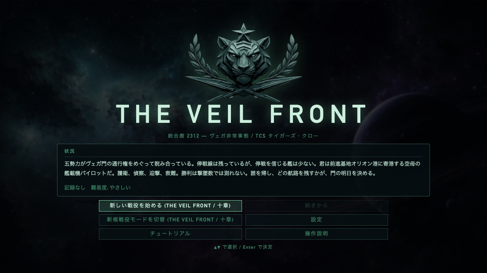

良い。紋章、副題、状況説明、難易度表示が1画面に収まっている。ここは手を入れる必要がない。

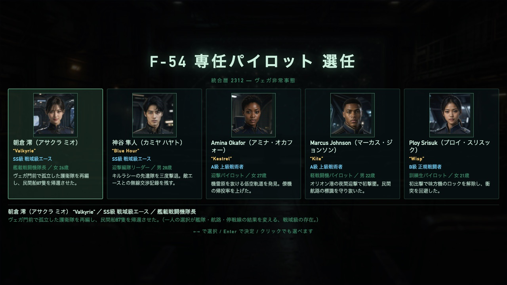

**所見**

- 5名の紹介文は魅力的だが、**選ぶと何が変わるのかが書かれていない**。
  技量・機体・僚機・台詞のどれが変わるのか分からないまま決めることになる。
- 表記が混在している。`朝倉 澪（アサクラ ミオ）` と `Amina Okafor（アミナ・オカフォー）` が同じ列に並ぶ。
- 画面の上下に大きな余白があり、カードが中央に寄っていない。

---

## 2. ブリーフィング

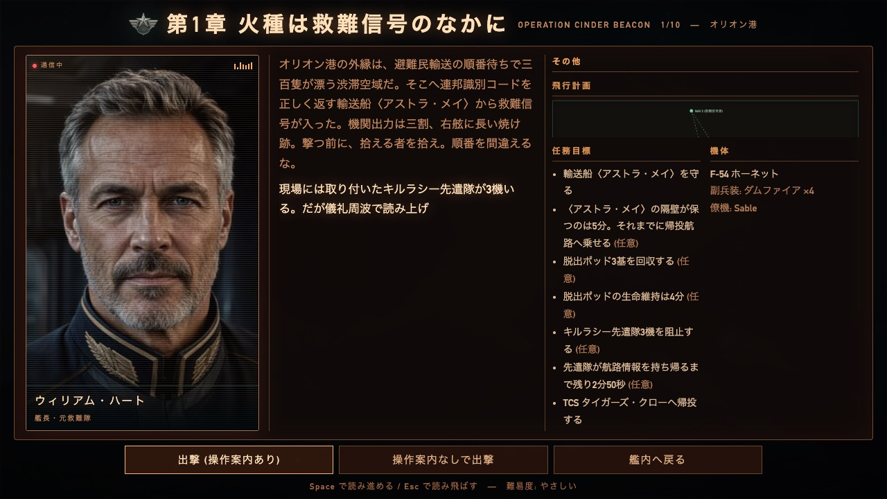

**所見**

- 艦長の顔と本文は非常に良い。文章の質は本家を上回る。
- **任務目標が7項目あり、うち6項目が「(任意)」**。何が必須で何が任意か、どれを優先すべきかが読めない。
- 右上の「その他」という見出しの下が空。
- 「飛行計画」の地図が横長の暗い箱で、`NAV 2 (救難区域)` というラベル1個しか描かれていない。
  面積の割に情報がない。
- 「機体」欄が3行（機体名・副兵装・僚機）だけ。速度も装甲も分からないので、
  格納庫で機体を選び直す判断材料にならない。

---

## 3. 第1章の出撃 — 「A キー2回」で任務達成

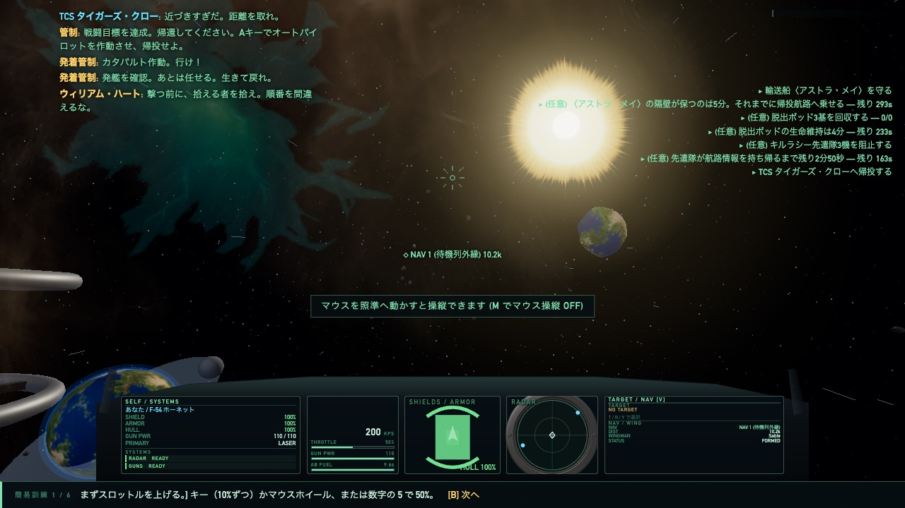

**所見（画面）**

- **コクピットの枠がない。** 画面下部にダッシュボードが浮いているだけで、風防・柱・天蓋が見えない。
  外部視点（`F`）に切り替えても、ダッシュボードはそのまま残る。

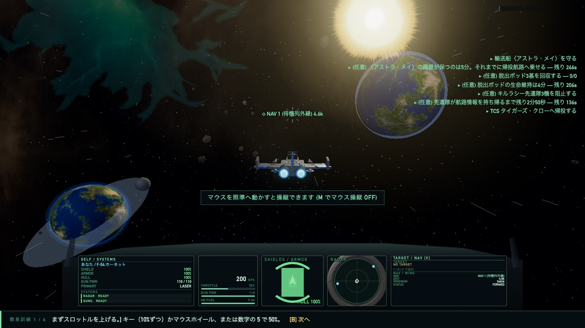

- 太陽が非常に明るく、右上の目標テキストと視線を奪い合う。
- 「マウスを照準へ動かすと操縦できます」のヒントが**画面中央に出たまま消えない**。
  カーソルを中央へ戻すまで消えない仕様のため、キーボードで遊ぶ間ずっと視界の真ん中を占める。

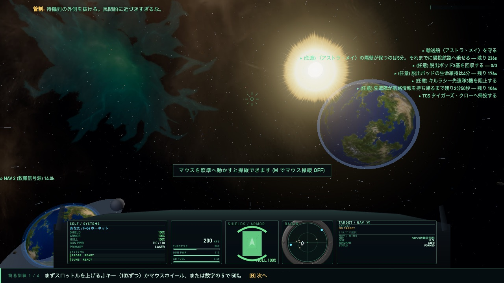

**所見（進行）**

- `A`（オートパイロット）で NAV 1 → NAV 2 へ移動。
- NAV 2（救難区域）に到着した時点で、**目標のキルラシー機は 11.4km 先、味方輸送船は 25km 先**。
  画面には何も映らない。一方で「脱出ポッドの生命維持 残り 4分」などのタイマーは減り続ける。
- 400 kps で旋回すると速度が 181 kps まで落ちる。追いつけない。
- 結果、**何もできないまま2つの目標が自動的に失敗した。**

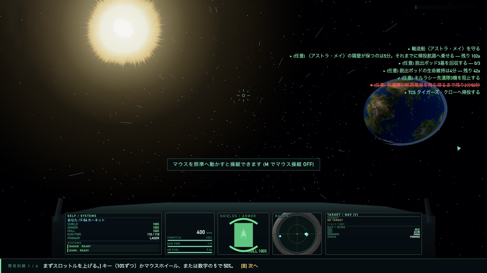

- 「キルラシー先遣隊3機を阻止する」に ✓ が付き、同時に
  「先遣隊が航路情報を持ち帰るまで残り2分50秒」に赤い取り消し線（失敗）が付いた。
  **1発も撃っていないのに、片方が達成で片方が失敗**という状態で、意味が読み取れない。

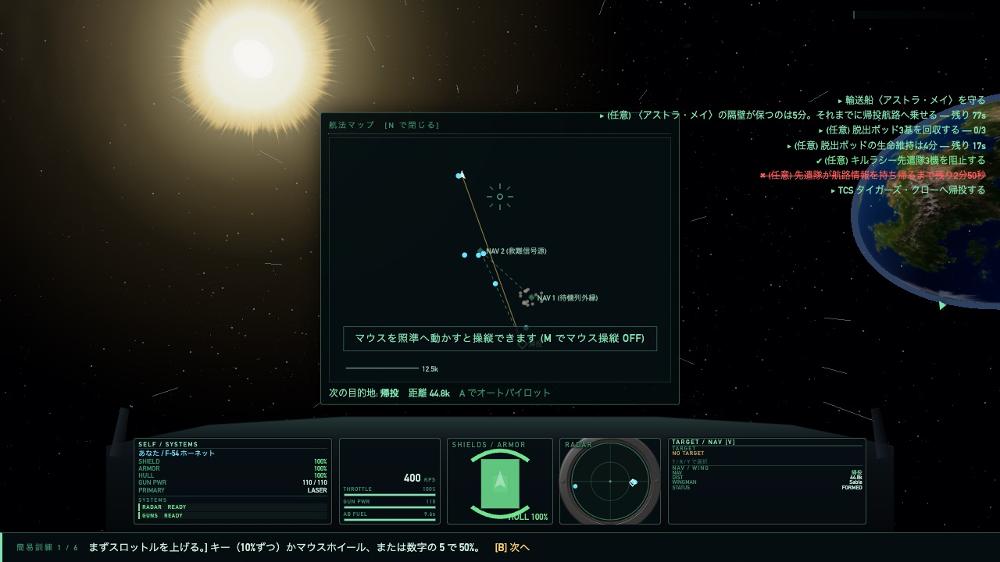

- 航法マップに**マウス操縦ヒントの帯が重なる**。マップの中心が読めない。
- マップに脱出ポッドや輸送船の区別がない（青い点が並ぶだけ）。近づく手段が示されない。

### 結果

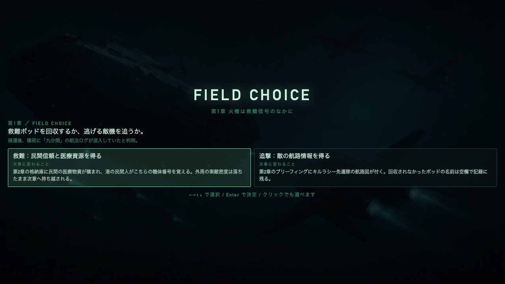
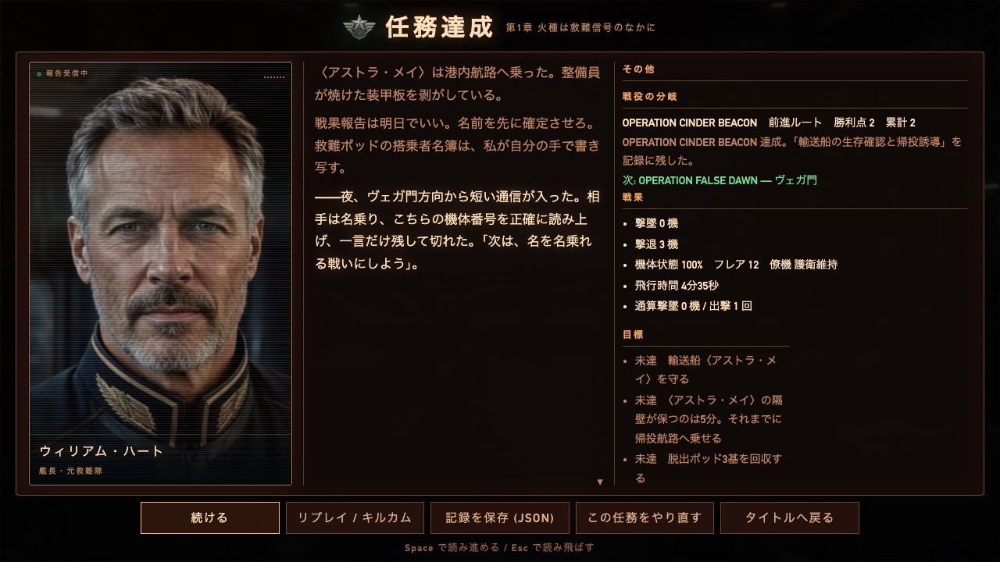

| 項目 | 表示 |
|---|---|
| 見出し | **任務達成** |
| 戦果 | 撃墜 **0** 機 ／ 撃退 3 機 ／ 飛行時間 4分35秒 |
| 目標 | 輸送船〈アストラ・メイ〉を守る … **未達** 隔壁が保つ5分以内に帰投航路へ乗せる … **未達** 脱出ポッド3基を回収する … **未達** |
| 戦役 | 前進ルート / 勝利点 2 |

**所見**

- **必須目標を含めて全て「未達」なのに「任務達成」**。
  仕組みとしては、`守る` や `制限時間` は「達成する目標」ではなく「制約」として扱われ、
  完了条件に数えられていない（破られたときだけ効く）。
  結果として、第1章は「オートパイロットで帰投する」だけで勝てる。
- 章末の FIELD CHOICE は「救難ポッドを回収するか、逃げる敵機を追うか」。
  **どちらも実際にはやっていない**のに、やったこととして選ばされる。
- 選択後、「帰還者」が **0（最低）→ 80（最高）** に上昇。救助数は 0名。

---

## 4. 艦内

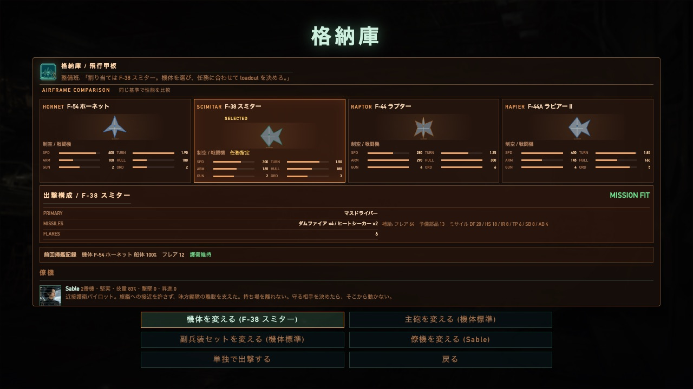

格納庫。4機の比較表は情報として良い。ただし**4機のシルエットがほぼ同じ星形の影**で、
見た目から性格の差が読み取れない。ロードアウトは「〜を変える」ボタンを押して順送りする方式。

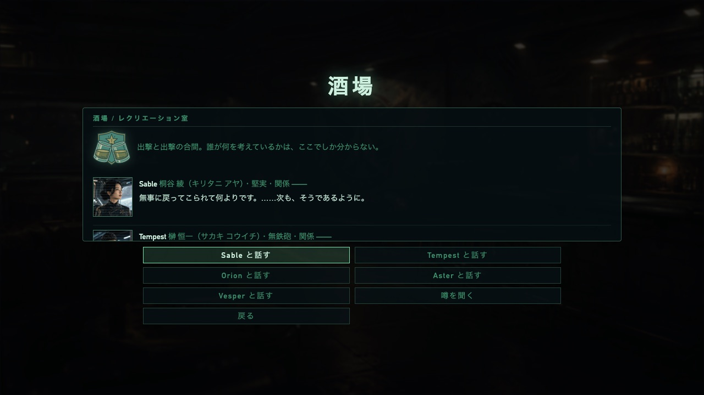
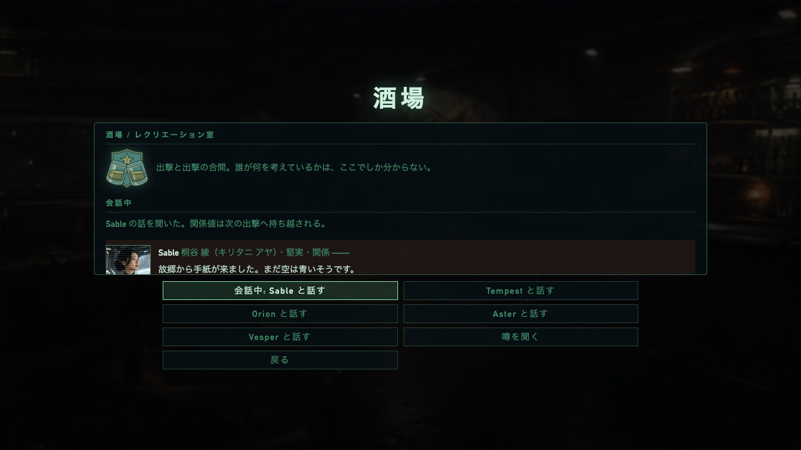

**所見**

- **パネルの下端で内容が切れている。** 2人目（Tempest）の行が途中で切られ、続きを見る手段がない。
  一方で、ボタンの下には 150px 以上の空白が残っている。
- 「関係 ——」と表示され、関係値が空。
- 会話は**1行で終わり**、選択肢も返答もない。「Sable の話を聞いた」と出るだけ。

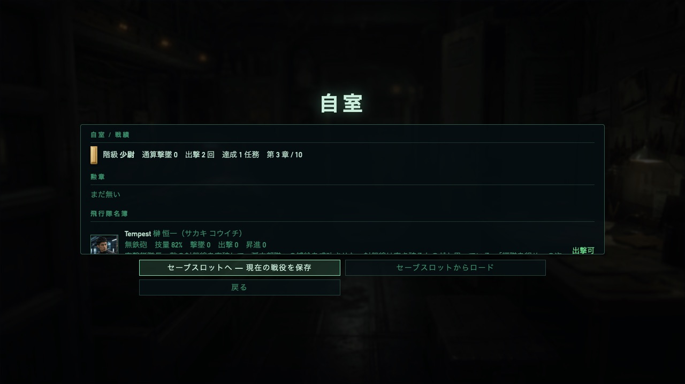
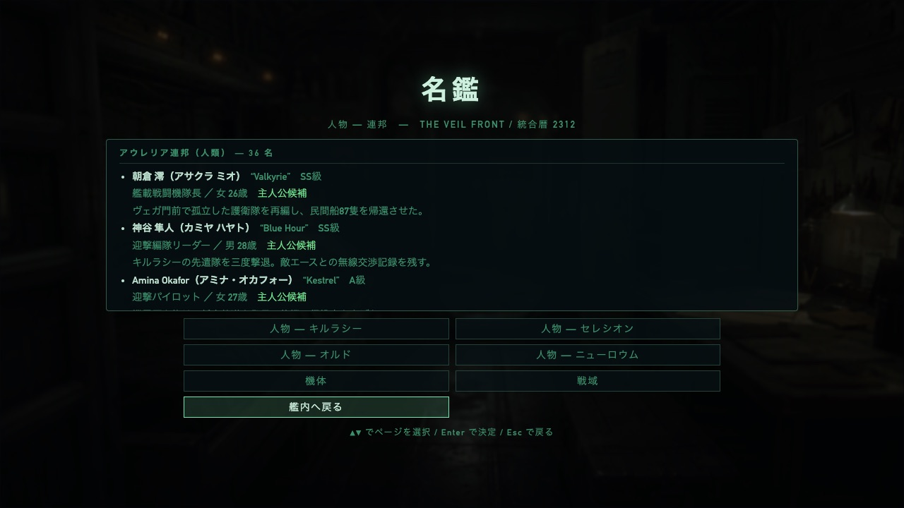
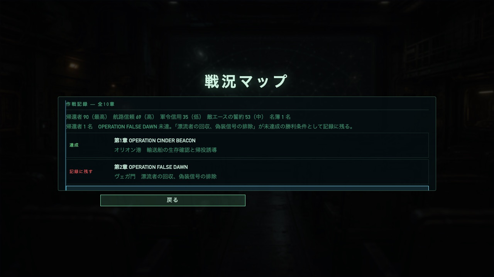

**所見**

- 自室・名鑑・戦況マップも同じく**パネル下端で内容が切れる**。
  名鑑は「アウレリア連邦（人類）— 36 名」と書いてあるのに、**3名しか読めない**。
  76名分の設定資料が、ゲーム内からは事実上読めない。
- 「戦況マップ」に**地図がない**。章の一覧が文字で並ぶだけで、3行目で切れている。

---

## 5. 第2章の出撃 — 敵が見えないまま撃墜される

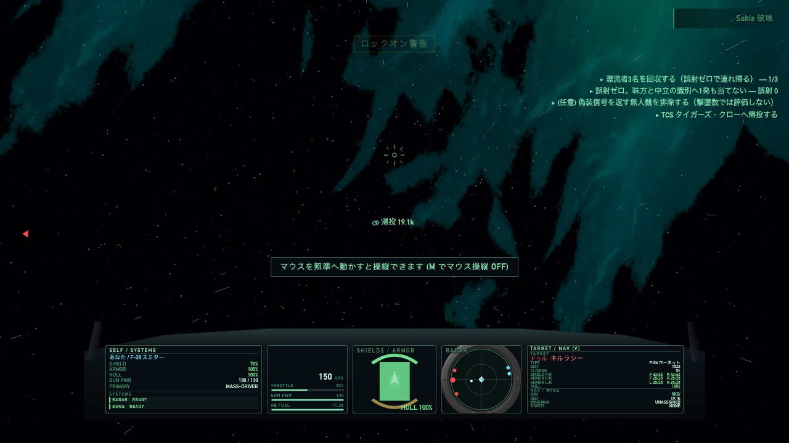

**所見**

- 画面右上に「Sable 破壊」と薄い文字が一瞬出た。**僚機が戦死した告知がこれだけ**。
  無線も、警告も、カメラも動かない。
- 「ロックオン警告」が出て、シールドが 76% → 50% と削られていく。
  **どの方向から撃たれているか分からない。**
- ターゲット距離 **1622m**（接近率 51）。画面に敵機は描かれず、左端に赤い △ の小さな印だけ。
  この △ は「画面外ターゲットの矢印」で、**敵機はカメラの視野の外（左後方）にいた**。
  つまり「近いのに描画されない」不具合ではなく、**敵がどこにいるか分からないまま撃たれ続けた**という問題。
  加えて、視野に入れたとしても 1622m でのホーネットは画面上わずか **約11px**、縁光がなく
  星雲と太陽が加算で明るいため、**いても気づけない**大きさだった。

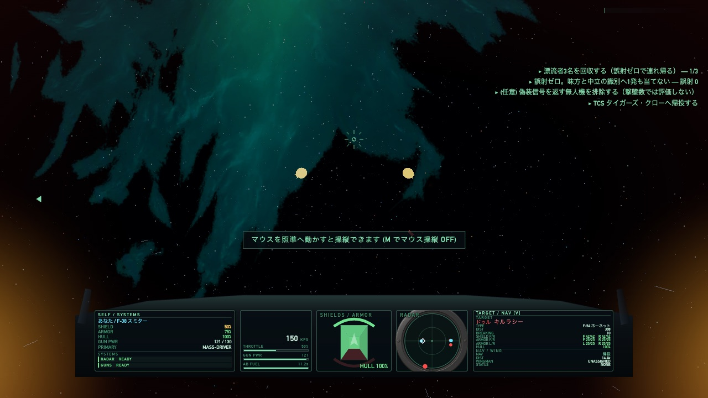

- 主砲を撃つと、黄色い丸い光が2つ空中に出る。**砲身にも自機にも接続して見えず、曳光も見えない。**
  当たったのかどうか分からない。
- ターゲット表示が「ドゥル キルラシー ／ TYPE **F-54 ホーネット**」。
  キルラシー兵が連邦機に乗っている表示になっており、敵味方の識別が混乱する。

### 結果

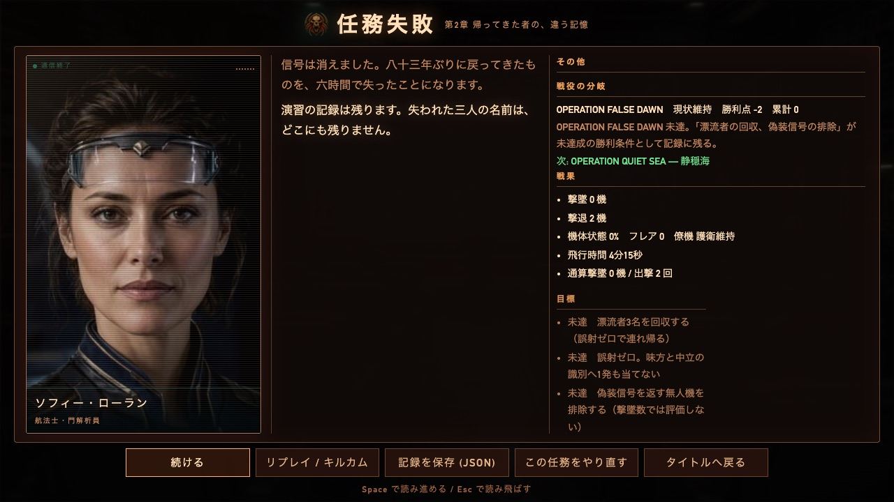

| 項目 | 表示 |
|---|---|
| 見出し | 任務失敗 |
| 機体状態 | **0%**（= 撃墜された） |
| 戦果 | 撃墜 0 機 ／ 撃退 2 機 ／ 飛行時間 4分15秒 |
| 戦役 | 現状維持 / 勝利点 −2 / **次: 第3章へ進む** |

**所見**

- **撃墜された瞬間に演出がない。** 戦闘中の画面から、そのまま章末選択画面に切り替わった。
  「墜ちた」という認識が持てず、デブリーフの「機体状態 0%」を読んで初めて死を知った。
- 脱出（`Alt+E`）を促す警告も、ハル残量の危機表示も認識できなかった。
- **死んでも戦役は止まらず、第3章へ進む。** 勝利点 −2 だけ。
- 帰還者は 80 → **90（最高）** に上昇。僚機が1名死んだ直後にである。

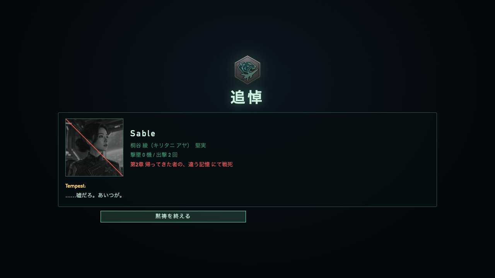

- 「追悼」画面は良い着想だが、Sable の死を機内で目撃していないため、感情が接続しない。
  台詞も1行。画面下半分が空白。

---

## 6. コクピット装飾を ON にした場合

設定 →「操作」タブ →「コクピット装飾（天蓋・ダッシュボード）」は **既定で OFF**。
ON にして再出撃した結果:

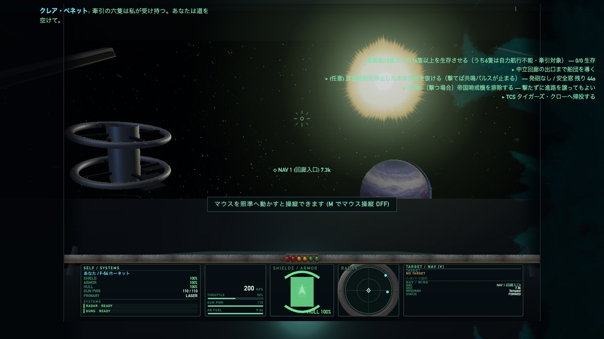

**所見**

- リベット付きの梁と警告灯の列が出るのは良い。
- ただし**視界が上下左右の黒帯で狭くなるだけ**で、風防や柱は見えない。
  「囲まれている」感覚は生まれず、単に画面が小さくなった印象になる。
- 左上に斜めの棒が浮いており、何かの部品が視界に入り込んでいるように見える。
- 目標テキストが太陽の光に重なり、**黄色の上に黄緑の文字で読めない**。

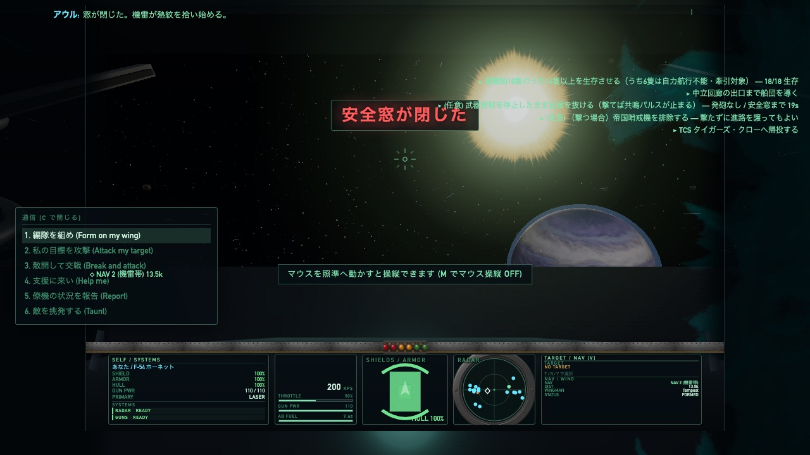

- 通信メニューは6項目のテキスト一覧。僚機の顔も状態も出ない。
  黒帯の上に描かれるため、コクピットの内外の境界も曖昧になる。
- 「安全窓が閉じた」という赤い大警告が出るが、**何をすべきかが書かれていない**。

---

## 7. 4分で死んだという事実について

難易度は「やさしい」（敵技量 30%、被ダメージ ×0.55、同時攻撃 1機まで）。
その条件で、**敵機を1機も撃墜できず、姿も見えないまま 4分15秒で撃墜された**。

これは「難しすぎる」という話ではありません。
**戦っている相手が画面に見えないので、対処のしようがない**という話です。
柱2（見える戦闘にする）を最優先に置く根拠がここにあります。

---

## 8. 良かった点（壊さないこと）

改善に着手するとき、以下は現状の強みなので触らないでください。

- **文章**。ブリーフィング、章末選択、デブリーフの本文はどれも水準が高い。
  「信号は消えました。八十三年ぶりに戻ってきたものを、六時間で失ったことになります。」のような一文が随所にある。
- **顔画像と CRT 風の通信枠**。人物の存在感がある。
- **タイトル画面**。紋章・副題・状況の3点が過不足なく収まっている。
- **格納庫の4機比較表**。同一スケールで並べる考え方は正しい。
- **章末選択の「次章に変わること」表記**。選択の結果を先に見せる設計は良い。
- **難易度設定に効果の内訳を書いている点**。何が変わるか分かる。
