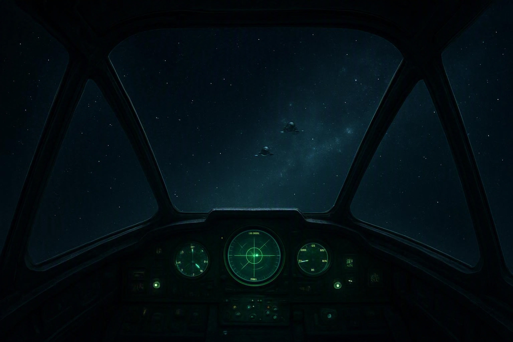

# W3 風防をガラスにして透明にする / W4 設定に「表示」タブを追加する

対象要件: 依頼 §要件 2・3
前提の解釈: [00_要件の解釈と全体方針.md](00_要件の解釈と全体方針.md) §2・§5

---

# W3 — 風防の側壁・天蓋をガラスにする

## 現状（`src/render/Cockpit.ts`）

開口部は NDC で 横 ±0.70 / 上 0.66 / 下 −0.40（`COCKPIT_OPENING`）。
その外側は**すべて不透明**で、視界を塞いでいる主犯は次の2部品である。

| 部品 | 行 | 現状 | 画面上の役割 |
|---|---|---|---|
| 天蓋の板 | 316-320 | `box` / `FRAME_DARK` / `pos [0, 0.828, -1.07]` / `scale [3.7, 0.09, 0.7]` / `rot [-0.3,0,0]` | 上側を塗り潰す |
| 側壁（左右） | 333-337 | `mirrored box` / `FRAME_DARK` / `pos [1.455, -0.05, -1.07]` / `scale [0.12, 2.2, 0.72]` / `rot [0, 0.25, 0]` | 左右を塗り潰す |

他は骨組み（柱・斜めの梁・桁・縦リブ・リベット）と計器盤・頬当てで、
**構造として必要なので残す**。

## あるべき姿

- 天蓋と側壁は「気密風防のガラス」になり、**その向こうの宇宙・敵機・母艦が見える**。
- 骨組み（柱・桁・リブ）は残るので「機体に乗っている」構図は崩れない。
- ガラスは無色ではなく、環境マップのごく淡い映り込みが載る（板ガラスに見せるため）。
- ガラスは**奥のものを隠さない**（`depthWrite: false`）。半透明の板の背後で
  敵機や曳光弾が消える事故を作らない。
- マテリアルは 1種だけ増やす（`PartBuilder` がマテリアル単位で畳むのでドローコールは +1）。

## 手順

### 手順 3-1 ガラスのマテリアルを足す

`src/render/Cockpit.ts`

1. マテリアルキーを追加する（`RIVET` の隣）。

```ts
/** 風防のガラス。骨組みの間に張る面。奥のものを隠さないので depthWrite しない */
export const GLASS = 'glass';
```

2. `material()` の `switch` へ追加する。

```ts
    case GLASS:
      /*
       * 板ガラス。透過は「素材の透明度」ではなく **描かない** ことで作る。
       * MeshPhysicalMaterial の transmission は屈折レンダーターゲットを毎フレーム焼くので、
       * 至近距離に 3枚（天蓋 + 側壁 2枚）置くと描画コストが跳ねる。
       * ここは「淡い映り込みが載った透明な板」に見えれば足りるので、
       * 環境マップを受ける標準マテリアルを低い opacity で使う。
       *
       * depthWrite: false — ガラスの背後の敵機・曳光弾・母艦を消さないため。
       *   （深度を書くと、後から描かれる不透明物がガラス面で捨てられる場合がある）
       * side: DoubleSide — 板が薄い箱なので、内側から見ても面が消えないようにする。
       */
      return new MeshStandardMaterial({
        color: 0x9fc4d8,
        transparent: true,
        opacity: GLASS_OPACITY,
        roughness: 0.08,
        metalness: 0,
        envMapIntensity: 0.9,
        depthWrite: false,
        side: DoubleSide,
      });
```

`DoubleSide` を three から import する。

3. 既定の濃さを定数として出す（設定から変えるので export する）。

```ts
/**
 * ガラスの既定の濃さ。
 * 0 にすると完全な素通しで「ガラスが無い」ように見え、
 * 0.25 を超えると遠方の敵機（画面上 10px 前後）が沈むので上限を 0.25 とする。
 */
export const GLASS_OPACITY = 0.1;
export const GLASS_OPACITY_MAX = 0.25;
```

### 手順 3-2 天蓋と側壁をガラスへ置き換える

`cockpitParts()` の中を次のように変える（位置・寸法・回転は変えない。マテリアルだけ変える）。

- 316-320 行の天蓋の板: `FRAME_DARK` → `GLASS`
- 333-337 行の側壁: `FRAME_DARK` → `GLASS`

**変えないもの**（変えると構図が崩れる）:

- 天井の桁2本（322-323）・背骨（325）・桁のリベット（327-329）
- 側壁の縦リブ3本（346-352）・壁と天蓋の境の桁（354-358）
- 柱と斜めの梁（255-312）、頬当てとコンソール（360-388）、計器盤（394-423）

側壁の縦リブは「壁の内側に立てて陰影を作る」ためのものだが、
ガラス化後は**ガラスを支える桟（マリオン）**として読める。位置も本数もそのままで意味が変わるので、
コメントを次のように書き換える。

```ts
  /*
   * ガラスを支える縦桟（マリオン）。
   * 以前は「無地の壁に陰影を作るリブ」だったが、W3 で壁をガラスへ置き換えたため、
   * ガラスの継ぎ目を示す構造材として残している。本数と位置は変えていない
   * （3本より増やすと視界が桟で切れる）。
   */
```

### 手順 3-3 zone を増やして表示切替に備える

`CockpitZone` を `'frame' | 'glass' | 'dash'` に拡張し、
GLASS の部品には `zone: 'glass'` を付ける。

```ts
/**
 * 部品の役割。
 * 'frame' = 骨組み（柱・桁・リブ・リベット）
 * 'glass' = 風防のガラス面（天蓋・側壁）
 * 'dash'  = 計器盤の筐体
 */
export type CockpitZone = 'frame' | 'glass' | 'dash';
```

### 手順 3-4 zone ごとに別グループへ組む

現在 `buildInterior()` は全部品を 1つの `PartBuilder` に入れている。
表示方法の切替（W4）で zone 単位に出し入れするため、**zone ごとに 3グループへ分ける**。

```ts
function buildInterior(): { frame: Object3D; glass: Object3D; dash: Object3D } {
  const materials = new Map<string, ReturnType<typeof material>>();
  const get = (key: string) => { /* 既存のキャッシュ処理をそのまま使う */ };
  const buildZone = (zone: CockpitZone) => {
    const b = new PartBuilder();
    for (const p of cockpitParts()) {
      if (p.zone !== zone) continue;
      b.add(geometryOf(p.geo), p.mat, { pos: [...], rot: [...], scale: [...] });
    }
    return b.build(get);
  };
  return { frame: buildZone('frame'), glass: buildZone('glass'), dash: buildZone('dash') };
}
```

**マテリアルのキャッシュ（`materials` Map）は 3グループで共有する。**
グループごとに新しいマテリアルを作るとドローコールが 3倍になる。

`Cockpit` クラスは `interior` 1本だったところを 3本持ち、
`syncToView()` の `onBeforeRender` 登録は 3グループの子すべてに対して行う。

### 手順 3-5 検証用の純関数を足す

`src/render/Cockpit.ts` の検証関数群（`nearestDistance` などの隣）へ追加する。

```ts
/**
 * 開口部の外側で、視界を塞ぐ不透明な大面積の部品を数える。
 *
 * 「側壁・天蓋がガラスになった」ことを機械的に固定するための検証用。
 * 画面上の面積が閾値より広く、かつ不透明なマテリアルを持つ部品を返す。
 */
export function opaqueBlockers(view: ViewSpec, minNdcArea = 0.25): CockpitPart[]
```

判定は `partNdcBounds()` の矩形面積（NDC 単位）で行い、
`zone === 'dash'` の部品は計器盤なので除外する。

## 期待される見た目の変化



コンセプト図（img-gen-gpt / gpt-image-1-mini で生成）。
**左右・上が透明で、残るのは前方支柱・上部桁・縦桟・計器盤だけ**という構図を狙う。
ガラス越しに上方の敵機2機が見えていることが、この作業のねらいそのものである。
（図は方向性の共有用で、実装の目標値は本文の NDC 座標が正）


| 位置 | 変更前 | 変更後 |
|---|---|---|
| 画面左右（NDC 0.70 の外） | 暗いスラブ（`FRAME_DARK`）＋リブ | ガラスの向こうに宇宙。柱と縦桟だけが手前に立つ |
| 画面上（NDC 0.66 の外） | 暗い天井の板 | ガラス越しに星と星雲。桁2本と背骨が横切る |
| 画面下 | 計器盤（変更なし） | 変更なし |

「上を向いたとき敵機が見える」ようになるので、
**格闘戦での位置把握が本家の透明キャノピーに近づく**（これが要件 2 のねらい）。

---

# W4 — 設定画面に「表示」タブを追加する

## 現状（`src/ui/SettingsPanel.ts`）

- タブは `game | controls | audio` の3つ。
- 見た目に関する項目が「操作」と「オーディオ」に散っている
  （ブルーム・閃光・色覚サポートがオーディオタブにある）。
- コクピットは `cockpitDecorations: boolean` の ON/OFF だけ。

## あるべき姿

- タブは `ゲーム | 操作 | 表示 | オーディオ` の4つ。
- 「表示」タブでコクピットの表示方法を**4択**から選べる。
- ガラスの濃さ（映り込みの強さ）を調整できる。
- 既存の見た目系項目は「表示」へ集約する（挙動と保存キーは変えない）。

## 手順

### 手順 4-1 設定項目を追加する

`src/app/settings.ts`

```ts
/**
 * コクピットの表示方法。
 * 'full'  … 骨組み + ガラス + 計器盤（既定。機体に乗っている構図）
 * 'glass' … ガラスと計器盤のみ（骨組みを消して視界を最大にする）
 * 'frame' … 骨組みと計器盤のみ（ガラスの映り込みを消す）
 * 'dash'  … 計器盤のみ（旧「コクピット表示 OFF」に近い見え方）
 * 'off'   … 何も出さない
 */
export type CockpitStyle = 'full' | 'glass' | 'frame' | 'dash' | 'off';
```

`Settings` へ追加する。

```ts
  /** コクピットの表示方法（W4）。旧 `cockpitDecorations` の後継 */
  cockpitStyle: CockpitStyle;
  /** 風防ガラスの映り込みの濃さ (0..1 を GLASS_OPACITY_MAX へ写す) */
  glassOpacity: number;
```

`DEFAULT_SETTINGS`: `cockpitStyle: 'full'`, `glassOpacity: 0.4`
（0.4 × `GLASS_OPACITY_MAX` 0.25 = 実効 0.1 = `GLASS_OPACITY` の既定と一致させる）。

### 手順 4-2 保存データの移行（版 4）

```ts
  // 版3以前: コクピット表示は boolean だった。ON→'full' / OFF→'dash' へ写す。
  // OFF を 'off' にしないのは、旧 OFF でも DOM の計器盤は出ていたため
  // （3D の筐体だけが消えていた）。見え方をそのまま引き継ぐのは 'dash'。
  if (version < 4) {
    loaded.cockpitStyle = parsed.cockpitDecorations === false ? 'dash' : 'full';
  }
```

- `DEFAULT_SETTINGS.settingsVersion` を **4** にする。
- `cockpitDecorations` は**フィールドとして残す**（古い保存データを壊さないため）が、
  実装からは読まない。`Settings` の JSDoc に「W4 で `cockpitStyle` へ移行。読み取り箇所なし」と書く。
- `normalizeSettings()` に追加する。
  - `cockpitStyle` が 5値のどれでもなければ既定へ戻す。
  - `glassOpacity` は `clampSetting(値, 0, 1, 0.4)`。

### 手順 4-3 タブを 4つにする

`src/ui/SettingsPanel.ts`

1. `type Tab = 'game' | 'controls' | 'display' | 'audio';`
2. タブ配列へ `['display', '表示']` を `controls` と `audio` の間に入れる。
3. 「操作」タブから次を**削除**（表示タブへ移す）:
   コクピット表示 / 被弾カメラ揺れ / 追尾視点の遅延 / アフターバーナー画角 /
   無線字幕サイズ / 無線ログの表示時間。
   **残す**: マウス操縦・マウス感度・上下反転・ゲームパッド系・飛行モード・
   自動水平・旋回補助・被弾時の時間減速・キー割り当て。
4. 「オーディオ」タブから次を**削除**（表示タブへ移す）:
   ブルーム / 閃光を抑える / 色覚サポート配色。
   **移動**: ゲームパッド振動 → 操作タブ。
5. 「表示」タブを次の順で組む。

```
コクピット表示     ◀ 風防ぜんぶ / ガラスのみ / 骨組みのみ / 計器盤のみ / 非表示 ▶
ガラスの映り込み   [────────] 40%        （コクピット表示が full / glass のときだけ出す）
被弾カメラ揺れ     [────────]
追尾視点の遅延     [────────]
アフターバーナー画角[────────]
ブルーム (発光のにじみ)  ON/OFF
閃光を抑える            ON/OFF
色覚サポート配色        ON/OFF
無線字幕サイズ     [────────]
無線ログの表示時間 [────────]
（説明）コクピット表示: 風防のガラスは奥の敵機を隠しません。視界を最大にしたいときは「計器盤のみ」。
```

`cockpitStyle` と `bloom` / `colorblindMode` の変更時は `onChange()` を呼ぶ
（現状の `cockpitDecorations` と同じ扱い。App 側の再適用が必要）。

### 手順 4-4 ゲーム側へ反映する

`src/app/game.ts:1274`

```ts
    this.scene.cockpit.setStyle(
      this.active && this.rig.mode === 'cockpit' ? settings.cockpitStyle : 'off',
    );
```

`src/render/Cockpit.ts` の `Cockpit` へ次を実装する。

```ts
  /** 表示方法を反映する。毎フレーム呼ばれる経路なので、同じ値なら何もしない */
  setStyle(style: CockpitStyle): void {
    this.syncToView();
    if (this.style === style) return;
    this.style = style;
    this.root.visible = style !== 'off';
    this.frameGroup.visible = style === 'full' || style === 'frame';
    this.glassGroup.visible = style === 'full' || style === 'glass';
    this.dashGroup.visible = style !== 'off';
    // 計器盤の下からの光は計器盤が出ているときだけ
    this.glow.visible = style !== 'off';
  }

  /** ガラスの濃さを設定から反映する */
  setGlassOpacity(ratio01: number): void
```

- 既存の `setVisible(boolean)` は**削除せず**、`setStyle(v ? 'full' : 'off')` へ委譲する
  ラッパとして残す（`TutorialDemo` など他の呼び出し元があれば型エラーで検出できるが、
  互換のため残すほうが安全）。呼び出し元を `grep -rn "cockpit.setVisible" src` で確認する。
- `setGlassOpacity()` は `settings.glassOpacity × GLASS_OPACITY_MAX` を
  GLASS マテリアルの `opacity` へ入れる。`onSettingsChanged` で購読するか、
  `setStyle` と同じ毎フレーム経路で「値が変わったときだけ」代入する。
  `glassOpacity` が 0 のときは `visible = false` にして描画自体を省く。

### 手順 4-5 外部視点との整合

`rig.mode === 'chase'` のときは従来どおり全体を隠す（上記コードの `'off'`）。
`this.hud.setExternalView(...)` の既存挙動は変えない。

## 検証

- 単体: `cockpitStyle` の 5値に対して、表示すべき zone の集合が仕様どおりであること
  （`Cockpit` は Three 依存なので、**zone → 可視集合の対応表を純関数
  `visibleZones(style): Set<CockpitZone>` として切り出し**、そこをテストする）。
- 単体: 版3 の保存データ（`cockpitDecorations: false`）を読むと `cockpitStyle === 'dash'` になる。
  `cockpitDecorations` 未指定の版3データは `'full'`。
- 単体: `cockpitParts()` に `zone === 'glass'` の部品が 3つ（天蓋1 + 側壁2）あり、
  すべて `mat === GLASS` であること。
- 単体: `opaqueBlockers({aspect: 16/9, fovDeg: 70})` が空であること
  （＝視界を塞ぐ不透明な大面積が残っていない）。
- ブラウザ: 1280×720 で第1章に出撃し、
  ① 既定（風防ぜんぶ）で左右・上にガラス越しの星が見える、
  ② 上を向いて敵機がガラス越しに見える（ガラス面で消えない）、
  ③ 5つの表示方法を順に切り替えてキャプチャを取り、`.tmp/` に保存して見比べる。
</content>
